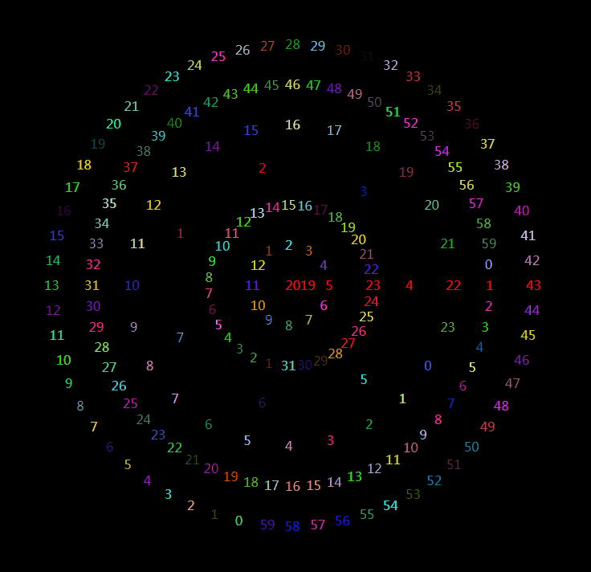

# CompassClock 罗盘时钟



The file offered a function `Clock` with one parameter `option`, its properties is below:  
在`Clock.js`中，该文件提供一个函数`Clock`, 函数需要传入一个参数`option`, 默认配置如下：

```js
    option = {
        containerId: "canvas", // DOM容器
        // 格式化函数
        formatterMonth: d => d,
        formatterDay: d => d,
        formatterWeek: d => d === 0 ? 7 : d,
        formatterHour: d => d,
        formatterMinute: d => d,
        formatterSecond: d => d,
        gap: 50, // 每层之间的间隔
        freshTime: 500, // 刷新时间
        currentColor: 'red', // 当前时间的颜色
        rotateText: false, // 文字是否旋转
        randomColor: true // 是否开启随机颜色
    }
```

**Note:** `containerId` is necessary, the others have default value.  
**注意：** `containerId` 是必须的，其余的参数有默认值，可以省略.


```html
    <script src="Clock.js"></script>
```

After import `Clock.js`, a "HOW TO USE" example is below:  
在自己的页面引入`Clock.js`后，一个调用的例子如下：

```js
    // test Data
    var option = {
        containerId: "canvas",
        formatterMonth: d => d,
        formatterDay: d => d,
        formatterWeek: d => d === 0 ? 7 : d,
        formatterHour: d => d,
        formatterMinute: d => d,
        formatterSecond: d => d,
        gap: 50,
        freshTime: 500,
        currentColor: 'red',
        rotateText: false,
        randomColor: true,
        layers: ['Year','Month','Day','Week','Hour','Minute','Second']
    }
    new Clock(option).run();
```